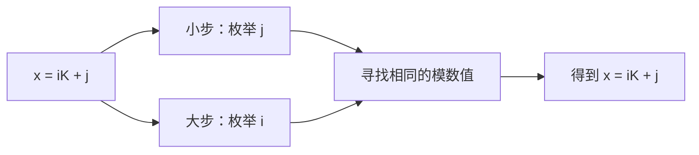

先把 BSGS 暂时和那份复杂代码分开。它的核心其实只有一句话：

> 把要枚举的指数 \(x\) 拆成“大步编号 × 块长 + 块内小步”。

## 1. BSGS 要解决什么问题

给定：

\[
a^x\equiv b\pmod p
\]

已知 \(a,b,p\)，要求 \(x\)。

比如：

\[
2^x\equiv5\pmod{13}
\]

最朴素的方法是依次计算：

\[
2^0,2^1,2^2,2^3,\ldots
\]

直到遇到 5。

这里：

\[
2^9=512\equiv5\pmod{13}
\]

所以答案是 \(x=9\)。

但如果可能的 \(x\) 有 \(10^9\) 个，一个一个枚举就太慢了。

---

## 2. 把 \(x\) 拆成两部分

假设需要搜索：

\[
0\le x<N
\]

选择一个块长：

\[
K\approx\sqrt N
\]

任何 \(x\) 都可以写成：

\[
x=iK+j
\]

其中：

- \(i\)：第几个大块
- \(j\)：块内第几个位置
- \(0\le j<K\)

例如 \(K=4\)，那么：

\[
9=2\times4+1
\]

也就是：

- 第 \(2\) 个大块
- 块内偏移 \(1\)



---

## 3. 如何把公式拆开

原式是：

\[
a^x\equiv b\pmod p
\]

代入 \(x=iK+j\)：

\[
a^{iK+j}\equiv b\pmod p
\]

拆开指数：

\[
a^{iK}\cdot a^j\equiv b\pmod p
\]

把 \(a^{iK}\) 移到右边：

\[
a^j\equiv b\cdot a^{-iK}\pmod p
\]

也就是：

\[
a^j\equiv b\cdot(a^{-K})^i\pmod p
\]

于是变成两边分别枚举：

- 小步枚举：
  \[
  a^j
  \]
- 大步枚举：
  \[
  b(a^{-K})^i
  \]

只要两边的值相同，就找到了对应的 \(i,j\)。

---

## 4. 用具体例子走一遍

求：

\[
2^x\equiv5\pmod{13}
\]

指数每 12 次循环一次，所以搜索：

\[
0\le x<12
\]

取：

\[
K=\lceil\sqrt{12}\rceil=4
\]

将指数写成：

\[
x=4i+j
\]

### 第一步：计算小步

计算：

\[
2^j\pmod{13}
\]

其中 \(j=0,1,2,3\)。

| \(j\) | \(2^j\bmod13\) |
|---:|---:|
| 0 | 1 |
| 1 | 2 |
| 2 | 4 |
| 3 | 8 |

把对应关系存入哈希表：

```text
1 -> j=0
2 -> j=1
4 -> j=2
8 -> j=3
```

这就是 Baby Step。

---

### 第二步：计算一次大步

大步需要计算：

\[
2^{-K}=2^{-4}\pmod{13}
\]

先计算：

\[
2^4=16\equiv3\pmod{13}
\]

所以需要求 3 的逆元。

因为：

\[
3\times9=27\equiv1\pmod{13}
\]

因此：

\[
2^{-4}\equiv9\pmod{13}
\]

每走一次大步，就乘以 9。

它的含义是：指数一次减少 4。

---

### 第三步：从目标 5 开始走大步

初始：

\[
b=5
\]

不断乘以 9：

| \(i\) | \(5\times9^i\bmod13\) | 是否在小步表中 |
|---:|---:|---|
| 0 | 5 | 否 |
| 1 | \(5\times9\bmod13=6\) | 否 |
| 2 | \(6\times9\bmod13=2\) | 是，\(j=1\) |

现在两边在数值 2 相遇了：

\[
2^1\equiv5\times9^2\pmod{13}
\]

因此：

\[
i=2,\qquad j=1
\]

最终：

\[
x=iK+j
\]

\[
x=2\times4+1=9
\]

验证：

\[
2^9\equiv5\pmod{13}
\]

答案正确。

可以把这个过程理解成：

```text
小步从 1 向前走：

1 --×2--> 2 --×2--> 4 --×2--> 8
           ↑
         在这里相遇
           ↓
大步从 5 向后跳：

5 --×9--> 6 --×9--> 2
```

其中乘以 9，相当于指数减去 4：

```text
2^9  →  2^5  →  2^1
 5       6       2
```

小步已经算出了 \(2^1=2\)，于是双方在 2 相遇。

---

## 5. 为什么是 \(O(\sqrt N)\)

如果直接枚举，需要检查 \(N\) 个指数。

BSGS 选择块长 \(K\)：

- 小步需要枚举 \(K\) 次
- 大步需要枚举约 \(N/K\) 次

总次数约为：

\[
K+\frac NK
\]

当：

\[
K=\sqrt N
\]

两部分最平衡：

\[
\sqrt N+\sqrt N=2\sqrt N
\]

因此：

- 时间复杂度：\(O(\sqrt N)\)
- 空间复杂度：\(O(\sqrt N)\)
